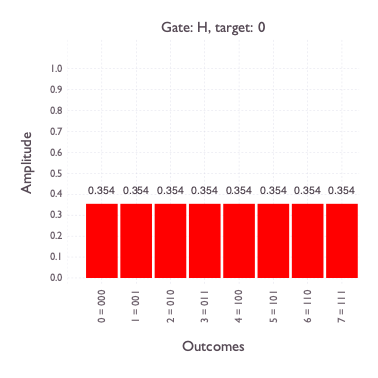

# Quantum Computing Simulator in Julia

## Glossary of Quantum Computing Terms

* __qubit__: dimension
* __amplitude__: complex number
* __outcome__: binary string or integer
* __state__: vector of amplitudes corresponding to outcomes
* __single-qubit gate__: pairwise linear transformation of amplitudes (e.g. X, Z)
    * __scaling__: H
    * __rotation__: phase
    * __controlled gates__: transformation restricted to subsets of outcomes
* __unitary matrix__: matrix corresponding to state transformations

## Sample Usage
```julia
@testset "Transform (loops vs matrices)" begin
    for n in 1:4
        state1 = init_state(Int(n))
        state2 = init_state(Int(n))

        for t in 0:n - 1
            transform!(state1, t, h)
            transform_with_matrix!(state2, t, h)
            @test state1 == state2
        end
    end
end
```

